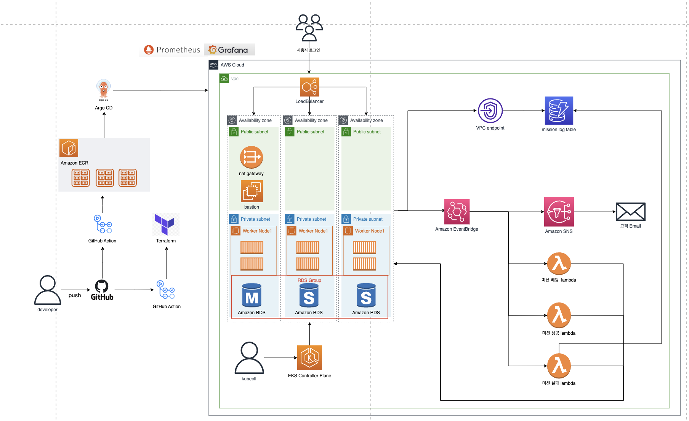

# Project: Mission Link
### JavaScript + Node.js + Nextjs 미션 관리 서비스 

 

# 💡 아키텍처 다이어그램

 

# 💻 프로젝트 소개
트윕(트위치 미션관리 시스템)에서 영감을 받아, 스트리머에게 미션을 걸고, 미션 성공 실패에 따른 보상을 지급하는 서비스

 

# ⌚ 개발 기간
23/06/12 ~ 23/06/27 

 

## 👬 멤버 구성
팀장 이주형: CI/CD 구현 및 WAS missions Endpoint, EKS 모니터링 구성 
팀원 김종훈: Terraform AWS VPC, EKS Cluster, AWS LoadBalancer Controller  구성, WAS 리팩토링 및 코드 리뷰 
팀원 김예성: WAS users Endpoint 구성,  JEST 테스트코드 작성 , IOC 컨테이너 구현 
팀원 이상협: Terraform AWS RDS, Dynamodb, AWS Lambda, Eventbridge 구성, dyanmodb WAS 작업

 

## 🎏 사용 기술 스택
사용언어:  
플랫폼:  
패키지 관리자:   
서버 프레임워크:  
IaC:  
CI/CD 파이프라인: 
 
모니터링: 
 
인프라: 

 

# 📌 인프라 특징
- 해당 서비스는 EKS 쿠버네티스 클러스터에 구성되어 있다
- WAS는 EKS 워커 노드로써 구현되어 있다
- WAS의 특정 이벤트를 수신하는 Eventbridge 구성
- WAS의 특정 이벤트에 대한 로그를 기록하는 DynamoDB
- Eventbridge는 규칙에 따라 각 lambda들을 트리거한다
- 특정 이벤트를 Eventbridge가 수신할 시, SNS를 통해 유저에게 이메일을 발송한다
- lambda는 이벤트에 대해 정해진 작업을 수행하며, 수행된 작업에 대해 WAS에 요청을 발송한다
- WAS는 lambda에서 받은 요청에 따라 RDS를 수정한다
- CI/CD 파이프라인으로 Github 레포지토리에 merge될 시 트리거되어, 자동적인 통합 및 배포를 실행한다
- EKS 클러스터는 모니터링 시스템에 의해 모니터링 된다

 

# 📌 주요기능
로그인 기능
- req.body에 포함된 userid와 password를 RDS에서 조회하여 검증
- 검증된다면 JWT 토큰 발급

유저 정보 관리
- JWT 토큰을 통해 authorization 구현
- GET 요청이 온다면 RDS에 접근하여 유저 정보를 조회한다
- POST 요청이 온다면 RDS에 신규 유저에 대해 추가한다

미션 관리
- 유저는 신규 미션을 설정할 수 있다.(미션내용, 미션금액, 제한시간)
- 다른 유저들은 생성된 미션에 대해 금액을 추가할 수 있다
- 스트리머가 미션을 성공할 경우, 미션금액이 스트리머에게 지급된다
- 스트리머가 미션을 실패할 경우, 미션에 금액을 건 유저들에게 환급된다

 

## 📔 스택 선정 이유
language - javascript 
팀원들의 코딩 수준이 비슷한 자바스크립트 채택

Framework - Next.js 
- 서버 프레임워크는 fastify 와 express 둘 중 고민
- 사용 경험 자체가 fastify 와 express 말고는 없는 점

fastify  
- fastify 는 express 에 비해 커뮤니티가 활성화 되지 않아 정보가 부족함
- 사용률이 낮아 정보가 매우 적은 편
- 성능이 가장 좋음

express
- express 는 커뮤니티가 많이 활성화 되어 정보가 많다 *중요
- 진입장벽이 낮다

nextjs - 채택
- 현재 점유율이 가장 좋은 프레임워크중 하나로 express 와 마찬가지로 커뮤니티가 많이 활성화 되어 정보가 많다 *중요
- 러닝커브 높음, 진입장벽이 조금 있다, 리액트의 개념도 포함되어 있기 때문
- 프론트엔드 작업도 같이 할 수 있다

IaC와 CI/CD, 모니터링 기술 스택은 대중적인 스택이라 이번 프로젝트에서 사용하였다.

