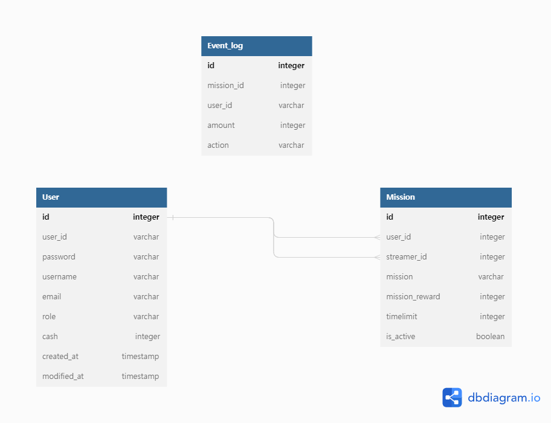
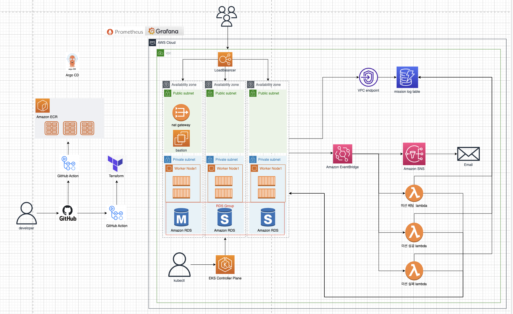

# 요구사항 분석
자유 시나리오에 따른 시나리오 설정을 진행.

## 프로젝트 시나리오

### 미션 관리 서비스

기능 요구사항
- 개인 사용자와 스트리머는 로그인 기능을 통해 토큰을 발급받을 수 있다.
- 토큰을 사용하는 로직 구현이 어렵다면 유저 데이터베이스에 접근해서 일치하는 사용자 정보가 있는 것을 확인하는 것으로 대체
- 개인 사용자 새로운 미션을 입력 및 조회할 수 있다.
- 스트리머는 미션에 대해 성공 및 실패를 선택할 수 있다.
- 성공 및 실패가 결정된 경우 개인 사용자는 해당 미션의 결과에 대한 email을 받을 수 있다.
- 미션을 수행하는 제한시간을 설정할 수 있다.
- 캐쉬를 충전하는 기능, 미션마다 포인트 설정, 성공하면 지급되야되고 실패 시 반환된다.
- 이미 생성된 미션에 경우 생성한 유저 이외의 유저도 캐쉬를 추가할 수 있다.

인프라 요구사항
- 시스템 전반에 가용성, 내결함성, 확장성, 보안성이 고려된 서비스들이 포함되어야한다.
- 하나 이상의 컴퓨팅 유닛에 대한 CI/CD 파이프라인이 구성되어야한다.
- 유저 데이터를 저장하고 있는 유저 데이터베이스는 다른 데이터베이스와 분리되어있어야한다.
- 미션 데이터를 기반으로 미션 성공에 대해 처리하는 시스템은 데이터 유실을 막기 위해 느슨하게 결합되어야한다.
- 시스템 메트릭 또는 저장된 데이터에 대한 하나 이상의 시각화된 모니터링 시스템이 구축되어야한다.

### 유저 시나리오
[role] 미션 만든사람  
- 최초 미션 내용 설정
- 포인트 설정
- 제한시간 설정
- 직접 Update 권한 없고(포인트 추가만 가능), Delete 권한 없음
- 사실 상 만들고 난 후엔 일반 사용자랑 똑같음
- 굳이 role 1, role 2 를 구분할 필요는 없는 것 같음

[role] 일반 시청자
- 미션 조회 가능
- 포인트 추가 가능

[role] 스트리머
- 미션 성공/실패 여부 마크
(미션 accept/reject 할 수 있으나 우선순위 아님)
- 시스템이 해야 할 일
- 미션 성공/실패 후 -> is_active: false
- 포인트 교환
- 어느 사용자가 해당 미션에 대해 얼마를 걸었고, 그 포인트가 성공 여부에 따라 자동 지급되어야 함

### ERD 작성

처음에는 미션의 베팅 정보를 가진 하나의 Table을 관리하려고 하였지만, EDA를 적용시키기 위해, Event_log라는 독자적인 DB Table을 설계하였다.

### Server 기술스택 설정
language - javascript
- 팀원들의 코딩 수준이 비슷한 자바스크립트 채택

Framework - Next.js
- 서버 프레임워크는 fastify 와 express 둘 중 고민
- 사용 경험 자체가 fastify 와 express 말고는 없는 점

fastify
- fastify 는 express 에 비해 커뮤니티가 활성화 되지 않아 정보가 부족함
- 사용률이 낮아 정보가 매우 적은 편
- 성능이 가장 좋음

express
- express 는 커뮤니티가 많이 활성화 되어 정보가 많다 *중요
- 진입장벽이 낮다

nextjs - 채택
- 현재 점유율이 가장 좋은 프레임워크중 하나로 express 와 마찬가지로 커뮤니티가 많이 활성화 되어 정보가 많다 *중요
- 사용만 가능하다면 최고의 프레임워크로 생각
- 러닝커브 높음, 진입장벽이 조금 있다, 리액트의 개념도 포함되어 있기 때문
- 프론트엔드 작업도 같이 할 수 있다
- server 와 client 를 별도로 나누질 않음

nextjs 채택 이유
- 커뮤니티가 많이 활성화 되어 정보가 많다
- 새로운 기술
- 2022 점유율이 가장 높으며 현재 핫한 프레임워크인 점
- express 와 fastify 두 서버 프레임워크에서 다뤄본 것과 유사, testing 완료
- routing 이 디렉토리로 하는 점 == fastify
- 미들웨어 == express
- 추후에 시간이 남을 경우 바로 client 작업이 가능한 점

## 아키텍처 다이어그램

왜 EDA를 채용해서 진행했는가?
- 기존에 구상하던 아키텍처로는 미션에 유저들이 금액을 얼마나 넣는지에 대한 정보를 가진 테이블을 구상하고 있었다.  
조금 관점을 다르게해서 베팅에 대한 로그로 쌓고 있다가, 미션완료라는 이벤트가 발생하면, 그때 "특정 id에 대한 로그를 취합해서, 최종 금액이 얼만지 계산한 후, 실제로 돈이 오가는 액션을 취하는 아키텍처"를 구상하게 되었다.  
이러한 이벤트를 다루는 아키텍처를 생성하는것이 흥미롭다고 생각했다.

EKS를 선택한 이유가 있는가?
- 시작은 팀의 개인적인 이유.  
세션에서 쿠버네티스 공부를 해보고 실습을 해보았지만, 부족하다고 생각되었고 이에 대한 경험을 쌓아보기 위해 ECS로 구성할 수도 있었다고 생각했으나, EKS라는 새로운 리소스를 사용해보기로 하였다.  
프로젝트가 끝나고 회고해본다면 분명 kubernete는 필요했다. 
ArgoCD나 모니터링 서비스를 구축하는데 pod가 10개 넘게 들어가는 상황이라, 오케스트레이션이 필요한 환경이라고 판단된다. 
서비스는 pod 한개만을 사용하고 있긴 하지만, 많은 트래픽이 발생하면 스케일링을 통해 처리할 수 있을 것이다. (EKS는 쿠바네티스 제어 플레인 노드의 가용성과 확장성을 자동 으로 관리)

RDS를 사용하는 이유:
 보안성, 확장성, 가용성 등 다양한 측면에서 이점을 제공한다.
 또한, RDS는 필요에 따라 자동으로 확장이 가능하며, 가용 영역 간의 복제를 통해 고가용성을 제공하기 때문에 사용하게 되었다.
 
DynamoDB를 사용하는 이유:
 AWS dynamodb는 nosql 서비스이며, 실시간 및 대용량의 데이터 저장과 처리, 자동으로 데이터의 확장성과 가용성을 관리하여 애플리케이션의 부하에 따라 자원을 조정, 서버리스 서비스라서 애플리케이션 개발자는 인프라 운영에 대한 부담을 덜 수 있다라는 점 때문에 채택했다.

EventBridge를 사용하는 이유:
 이벤트 중심 아키텍처를 구축하기 위해 사용되는 서비스이다. 이벤트 중심 아키텍처는 시스템의 다양한 구성 요소 간에 발생하는 이벤트에 중점을 둔 방식으로 시스템을 설계하는 접근 방식이다.
 느슨한 결합(loose coupling)을 통해 시스템을 구성하므로, 각 구성 요소는 독립적으로 작동하고 확장 가능하며, 이벤트를 통해 상호작용할 수 있다.
 다양한 소스에서 발생하는 이벤트를 감지하고, 필요한 대상으로 이벤트를 라우팅할 수 있다.

VPC(Virtual Private Cloud) 엔드포인트를 사용하는 이유:
 Amazon Web Services(AWS)에서 제공하는 서비스로, VPC 내에서 AWS 서비스에 안전하게 연결하기 위한 기능을 제공하며, VPC 내의 리소스와 AWS 서비스 간의 트래픽이 AWS 네트워크를 통해 전송되지 않고, 직접적으로 전달된다.
 퍼블릭 인터넷을 통한 통신을 우회하므로, 인터넷을 통한 외부로의 액세스가 필요하지 않을 때 보안상 이점을 제공한다.
 AWS 서비스와의 통신이 AWS의 전용 네트워크를 통해 이루어지므로, 인터넷 트래픽 비용을 절감할 수 있다.

SNS를 사용하는 이유:
 AWS에서 제공하는 관리형 메시지 및 알림 서비스, 다양한 종류의 메시지 전송을 지원하며, 미션 별로 데이터를 전송하거나, 이메일을 보내는 등 다양한 통신 기능을 활용하기 위해 채택했다.

Lambda를 사용하는 이유:
 AWS에서 제공하는 서버리스 컴퓨팅 서비스로, 이벤트에 응답하여 코드를 실행하는 함수형 서비스이며, 서비스가 필요한 시점에 자동으로 트리거 되도록 설계할 수 있다. 느슨한 결합을 구현하여 애플리케이션의 유연성과 확장성을 향상할 수 있다. 이러한 이유로 채택하였다

Failsafe 관련된 인프라가 부족해 보인다.
- 부족한 점으로써 꼽을 수 있었는데, 아키텍처 회의때 CTO분께서도 관련된 조언을 해주셨지만, 아키텍처 상에 여러번 수정이 가해지고, 그에 대한 부분을 놓쳤다고 생각된다. 
내결함성이나 보안성을 고려해서 lambda에서 WAS로 들어오는 요청 사이에 SQS와 DLQ를 배치해서 FailSafe를 고려해 볼 수 있었다고 판단된다. 

### 아키텍처 시나리오
- 유저는 로그인 엔트포인트에서 로그인 후, 토큰 발급 받음
- users 엔드포인트에서 user에 대한 정보를 확인할 수 있다.
- missions 엔드포인트에서 mission에 대한 생성 및 수정, 읽기를 할 수 있다.
- missions/[missionId]/event에서 특정 이벤트 발생시, 이벤트에 관련된 작업들을 실행할 수 있다.(Eventbridge에 event 발생, Dynamodb에 이벤트 로그 작성)
- missions/[missionId]/fail, success, bet에서 이벤트 발생시 트리거된 람다에서 들어오는 요청에 대해 실질적인 RDS 작업을 한다.(bet의 경우 유저의 cash를 차감, mission reward에 금액 추가, fail, success의 경우, success는 해당 스트리머에게 reward를 지급, fail의 경우 cash를 환급)

## 트러블 슈팅
## CI/CD
### github action 관련
Dockerfile을 찾지 못함 
일단 이 시점에서 만든 github action은 내가 만든 WAS를 docker image로 만들어 ECR로 배포하는 action을 구성하였다.

최초에는 action template으로 action을 생성했는데, 
에러: Dockerfile not found 발생 
원인: WAS를 image로 만드는 Dockerfile을 만들지 않은 상태에서, action을 먼저 생성시켜 이미지 빌드시에 에러가 발생했다.

이후 WAS 디렉토리에 Dockerfile을 만들고, Action을 실행하였더니,

에러: Dockerfile not found 발생 
원인: Dockerfile이 github action이 작업하는 디렉토리와 다른 디렉토리에 있는 것이 원인이였다. 
해결: github action은 checkout으로 레포지토리의 내용을 가져가고, 레포지토리의 루트에서 작업을 하는데, WAS는 /server 디렉토리 안에 있느 상황이였기에, action 중간에 cd server 명령어를 추가해 주었다.

에러: docker image build failed, Dockerfile 내부의 npm run build 작업에서 오류 발생 
원인: build하기 위한 파일이 부족. npm run build를 하기 전에 Copy . . 으로 작업 디렉토리로 파일들을 복사해가야하는데 해당 작업 전에 npm run build가 실행됨. 빌드할 리소스들이 없으니 에러가 발생. 
해결: Dockerfile의 명령 순서를 변경하였다.

#### github action 트리거 push에서 pull request로 변경했을때 문제
내 로컬 상에서는 작동이 되었지만, upstream 레포지토리에 PR를 생성하였을 때는 에러가 발생했다.

발생한 에러는 AWS credential에서 로그인하지 못하는 에러가 발생하였는데
원인은 secret에 저장된 access key를 가져오지 못하는 것이였다. 
github action 트리거가 pull request일 시에, 안전을 위해 action에서 참조하지 못하기에 발생하는 오류였다.

에러를 고치기 위한 시도가 있었다.

1. on: pull_request: type: -synchronize => pull request가 동기화될 때마다 트리거 => 아예 트리거가 안됨
2. on: pull_request: types: - closed => pull request가 close 될때 트리거 => 아예 트리거가 안됨=> 지금 생각해본다면, branches와 paths가 같이 조건으로 설정되어 있는데, 이들 중에 조건이 안맞았던 것으로 추측됨.
3. on: push로 돌아옴

해당 트리거로 추구했던것은 PR이 merge되면 WAS 관련 디렉토리가 변경될 시에 CI/CD가 트리거되는 것이였다. 
PR이 Merge될때의 트리거를 여러 방면으로 찾다가, github discussion에서 on: push하고 paths를 설정하면 된다는 글을 확인하였다.

#### kustomize
EKS manifest 파일의 변경사항을 적용하여 새로 빌드해주는 kustomize를 적용시켰다.

문제: kubectl kustomize로 사용하였더니 정상적으로 빌드하지 못하는 문제 발생.  
원인: kubectl에 내장된 kustomize로 작동시에 kustomization.yaml을 제대로 파악하지 못하는 에러 발생  
해결: kustomize를 따로 설치해서 사용하니 정상적으로 작동

#### Github action을 이용한 EKS 배포
최초에는 해당 방식으로 EKS CD를 진행했다. 
기존에 ECR에 배포되는 워크플로우에 manifest 파일이 저장된 위치로 이동하여 해당 위치에서 action 도중에 생성된 이미지의 새로운 태그를 가져다가 manifest를 해당 태그로 수정하였다.

여기서 문제가 하나 발생한다. 
Github action은 원격 환경이기 때문에 해당 환경에서 manifest를 수정해도 수정된 사항이 레포지토리에 반영되는 것이 아니다. 
즉 워크플로가 종료되면 변경된 사항이 휘발된다.

선택한 해결 방법은 manifest 변경점을 action에서 다른 레포지토리로 push하는 방법을 사용하였다.

#### 다른 레포지토리 Push 시에 문제점
문제점: Push에 access denied 오류가 발생 원인: github access token으로 인증을 해야하는데, 토큰 정보가 없음  
해결: Github secrete에 access token을 넣어주고 이를 확인한 후 Push.

### EKS 관련 트러블슈팅
#### 0/1 nodes are available: 1 Too many pods. preemption: 0/1 nodes are available: 1 No preemption victims found for incoming pod..  
문제:Worker node에 pod를 새로 배치할 자리가 없어서 생긴 오류. 
원인: EKS에는 t3.medium node 하나만 사용하는 상태였는데, node에는 17개의 pod를 할당할 수 있다. 
하지만 17개 이상으로 pod가 배치되려고 해서 생긴 오류  
해결: Worker node Group에 최대 노드 개수를 2개로 늘린다. scaling 되면서 pod들이 분산된다.

#### waiting for a volume to be created, either by external provisioner “ebs.csi.aws.com” or manually created by system administrator
문제: Persistent volume들이 필요한 pod들이 볼륨을 생성하지 못하고 pending 되는 상태 
원인: AWS EBS를 PV로 사용하려면 접근권한을 설정해야 하는데, 권한이 설정되지 않았다. 
해결: Oidc-provider를 설정해주고, oidc-provider로 service account를 생성한다.
Service account를 가지고 CSI 드라이버 역할을 설정하고 addon으로 추가한다. 
Pending 상태의 Pod들을 다시 확인하면 정상적으로 배포된 것을 확인할 수 있다.

### terraform 인프라 관련 트러블슈팅
### 모듈별로 작성했을 때, 리소스들 못 찾는 문제 
문제: 서로 다른 모듈 안에 있는 리소스를 module. 형식으로 사용하고 싶었다. 하지만 다른 모듈에 리소스를 찾지 못하는 상태였다. 
원인: 다른 모듈에 있는 값을 알지 못하기 때문에 불러오지 못함 
해결 : 다른 모듈에 있는 리소스를 사용하려면 outputs.tf를 이용하여 사용하려는 모듈에 리소스를 명시하고, 그 리소스를 받을 모듈에 variables.tf에 명시해야 한다. 또한 루트 디렉터리에 있는 main.tf에 variables.tf에 지정한 변수명 = outputs.tf에 있는 변수명 형식으로 사용하겠다는 명시를 해줘야 한다. 

### Error: local-exec provisioner error │ │ with module.mission_link_event.module.mission_link_success_lambda.null_resource.archive [0], │ on. terraform/modules/mission_link_event.mission_link_success_lambda/package.tf line 63, in resource "null_resource" "archive": │ 63: provisioner "local-exec" { 
...

문제: 테라폼에서 기본적으로 제공하는 source인 "terraform-aws-modules/lambda/aws"를 써서 만들 때, lambda에 기반이 되는 code 파일을 찾지 못하는 문제가 있었다. 
원인: terraform apply를 해서 처음 zip 파일을 만들었을 때, 이것을 인식하지 못했다. 
해결: 다시 terraform apply를 하면 무사히 zip 파일을 찾아서 lambda를 만들 수 있다. 

### lambda에서 eventbridge,dynamodb 데이터 받을 시 문제점
문제: lambda에서 dynamodb, eventbridge의 데이터를 받은 과정에서 access denied라는 오류가 나왔다 
원인: lambda의 실행 역할에 dynamodb, eventbridge 관련 정책을 연결해 주지 않아서 데이터를 받아올 수 없었다. 
해결: "aws_iam_role_policy"에 dynamodb, eventbridge 두 개에 데이터에 접근할 수 있는 정책을 추가해서 lambda의 실행 역할에 연결해 주었다. 

### 기능 관련 트러블슈팅
### "require is not defined in ES module scope, you can use import instead\nThis file is being treated as an ES module because it has a '. js' file extension and '/var/task/package.json' contains \"type\": \"module\". To treat it as a CommonJS script, rename it to use the '. cjs' file extension.",
...

문제: 자바스크립트로 코드를 구성하는데 require을 통해 모듈을 불러오는 부분에서 오류가 났다.<pr>
원인: ES 모듈을 사용하는데 모듈에 require가 정의되지 않았다.<pr>
해결: JavaScript에서 모듈 시스템을 구현할 때, CommonJS와 ES 모듈 두 가지 방식을 쓰는데, package.json에 type: module로 정의해서 import문을 써야 했다. type: module로 정의된 것을 지워서 require문을 쓸 수 있도록 해결했다. 

### [Object: null prototype] {'{"Items":[{"action":"missionCreate","user_id":2,"mission_id":1,"amount":3000,"streamer_id":1,"id":"2"}],"Count":1 "ScannedCount":2}': ''}
...

문제: 서버가 lambda가 보낸 데이터 형식에서 데이터를 읽지 못하는 것이다.
원인: lambda에서 axios를 보낼 때, JSON.stringify를 써서 데이터를 보내는데, json 형식으로 데이터가 간다. 하지만 이 데이터를 받으려면, 서버 측에서 객체로 변환해야지 이 데이터를 읽을수 있다.
해결: lambda에서 데이터를 보낼 때 객체 형태로 보내도록 구성해서 서버에서 데이터를 읽을 수 있도록 하였다.

### jest encountered an unexpected token
에러는 Jest 테스트 실행 중에 JavaScript 파일에 의도하지 않은 토큰이 포함되어 있을 때 발생. 
이러한 토큰은 주로 잘못된 구문 또는 모듈 로드 오류로 인해 발생할 수 있다고 생각해. 
이 문제를 해결하기 위해서 디버깅
1차 Babel 구성 확인
2차 Jest.config.js 파일확인
3차 문법 오류 확인 javScript 구문과 일치하지않는 문법이있는지 확인결과 문법오류가있는것을 확인하고 수정

### Error retrieving secrets: secretName is not defined 
"secretName 을 aws상에서 찾을수없다고 생각했는데  코드상에 "secretName" 을 선언하지 않아서 오류가 발생
1."secretName 선언

### Could not find a production build in the
빌드를 하지않아서 발생한 문제 빌드를 하였지만 또다시 에러가 발생 package.json에 에러가있어 삭제하고
다시 "npminstall을 통해 다시 설치하였지만 버전이 맞지않아 버전변경

1.빌드
2.packge.json 에러 삭제후 npminstall
3.버전오류 버전 수정

# 테스트 코드와 ioc컨테이너를 쓴이유

# 테스트코드

<aside>

테스트 코드를 작성하는 이유는 소프트웨어 개발 및 유지보수 프로세스에서 몇 가지 주요 이점을 제공하기 때문입니다. 다음은 테스트 코드 작성의 중요성과 이유입니다:

1. 버그 및 결함 검출: 테스트 코드를 작성하면 소프트웨어의 기능, 모듈 또는 시스템을 자동으로 테스트하고 버그 및 결함을 검출할 수 있습니다. 이를 통해 초기에 버그를 발견하고 수정할 수 있으며, 소프트웨어의 신뢰성과 안정성을 향상시킬 수 있습니다.
2. 코드 변경의 안전성 보장: 새로운 기능 추가, 기존 코드 수정 또는 리팩토링과 같은 코드 변경 작업을 수행할 때, 테스트 코드는 변경된 코드의 기능을 검증하고 이전 기능이 정상적으로 작동하는지 확인하는 데 도움을 줍니다. 이를 통해 코드 변경으로 인해 예기치 않은 부작용이 발생하는 것을 방지할 수 있습니다.
3. 문서화와 설계 지원: 테스트 코드는 소프트웨어의 기능과 동작을 명확하게 문서화하는 역할을 합니다. 테스트 코드는 코드를 작성하는 동안 기대되는 동작을 설명하고 예시를 제공함으로써 소프트웨어 설계와 개발 과정을 지원합니다.
4. 개발 생산성 향상: 테스트 코드를 작성하면 코드 작성과 동시에 기능을 테스트할 수 있으므로 버그를 조기에 발견하고 수정할 수 있습니다. 이는 개발자의 생산성을 향상시키고 디버깅에 소요되는 시간과 노력을 줄여줍니다.
5. 리팩토링 지원: 테스트 코드는 코드 리팩토링을 보다 안전하게 수행할 수 있도록 도와줍니다. 리팩토링은 코드의 구조와 가독성을 개선하거나 성능을 향상시키는 등의 코드 변경 작업을 의미합니다. 테스트 코드가 있다면 리팩토링 후에도 기능이 올바르게 작동하는지 확인할 수 있으며, 기능에 영향을 주지 않으면서 코드를 개선할 수 있습니다.

테스트 코드는 소프트웨어의 품질과 안정성을 높이고, 개발 프로세스를 지원하며, 유지보수를 용이하게 만들어주는 중요한 요소입니다. 테스트 주도 개발(Test-Driven Development)과 같은 방법론을 적용하여 테스트 코드를 작성하면 개발 프로세스를 효과적으로 개선할 수 있습니다.

</aside>

- 버그 및 결함 검출: 저희 시나리오에서 작성한 “users”와 “missions” 가 정상작동하는 방법을 확인하기 위해 작성하였고 미리 배포하기전에 테스트를 돌려봄으로써 버그 및 결함이 있는지 확인함으로 인해  소프트웨어의 신뢰성과 안정성을 향상시킬수있어서 도입하였습니다.
- 코드 변경이 있거나 기능추가가 있을경우 코드변경으로 인해 예기치 않은 부작용이 발생하는것을 방지할수있고 개발 생상성 향상 시키고 디버깅에 소요되는 시간과 노력을 줄여줍니다 리팩토링을 할경우 보다 안전하게 리팩토링을 할수있게 하려고 도입하였습니다.

# loc 컨테이너

<aside>

IOC(Inversion of Control) 컨테이너를 사용하는 이유는 다음과 같습니다:

1. 의존성 관리: IOC 컨테이너는 객체 간의 의존성을 관리하는 기능을 제공합니다. 객체가 필요로 하는 다른 객체에 대한 의존성을 명시적으로 선언하고, 컨테이너가 해당 의존성을 자동으로 주입해줍니다. 이를 통해 객체 간의 결합도를 낮추고, 유연하고 확장 가능한 애플리케이션을 만들 수 있습니다.
2. 객체의 라이프사이클 관리: IOC 컨테이너는 객체의 생성, 초기화, 소멸과 같은 라이프사이클을 관리할 수 있습니다. 객체의 생성과 소멸을 컨테이너가 담당하므로, 개발자는 객체 생성에 집중하지 않고 비즈니스 로직에 집중할 수 있습니다.
3. 설정의 외부화: IOC 컨테이너는 애플리케이션의 설정 정보를 외부 설정 파일(XML, YAML, JSON 등) 또는 어노테이션을 통해 관리할 수 있습니다. 이를 통해 애플리케이션의 설정 변경이나 확장이 용이해지며, 개발자는 코드 변경 없이 설정을 수정할 수 있습니다.
4. 테스트 용이성: IOC 컨테이너를 사용하면 테스트 작성이 용이해집니다. 의존성 주입을 통해 테스트할 객체에 대한 가짜(mock) 객체를 주입하거나, 테스트용 객체를 주입하여 단위 테스트를 수행할 수 있습니다. 이를 통해 모듈 또는 애플리케이션의 테스트 커버리지를 높일 수 있습니다.
5. 코드의 재사용성과 모듈화: IOC 컨테이너를 사용하면 코드의 재사용성과 모듈화가 강화됩니다. 컨테이너에 등록된 객체들은 다른 애플리케이션 모듈에서도 사용할 수 있으며, 객체의 의존성 주입을 통해 모듈 간의 결합도를 낮출 수 있습니다.

IOC 컨테이너는 개발자가 객체 생성, 의존성 관리, 라이프사이클 관리 등의 작업에 대한 부담을 줄여줌으로써 개발 생산성을 향상시키고, 유지보수를 용이하게 만들어줍니다. 또한, 애플리케이션의 유연성과 확장성을 높이는데 도움을 줍니다.

</aside>

- loc컨테이너를 사용해서 테스트 작성을 용이하게 할필요가있었습니다 협업하는과정에서  각자맡은 업무에서 WAS서버는 이미 만들었지만 인프라가 없는 환경에서 내가 작성한 기능이 정상작동하는지 테스트해보고 싶어서 가짜(Fake)를 만들어 테스트하기위해서 Ioc컨테이너를 사용하게 되었습니다

의존성 주입